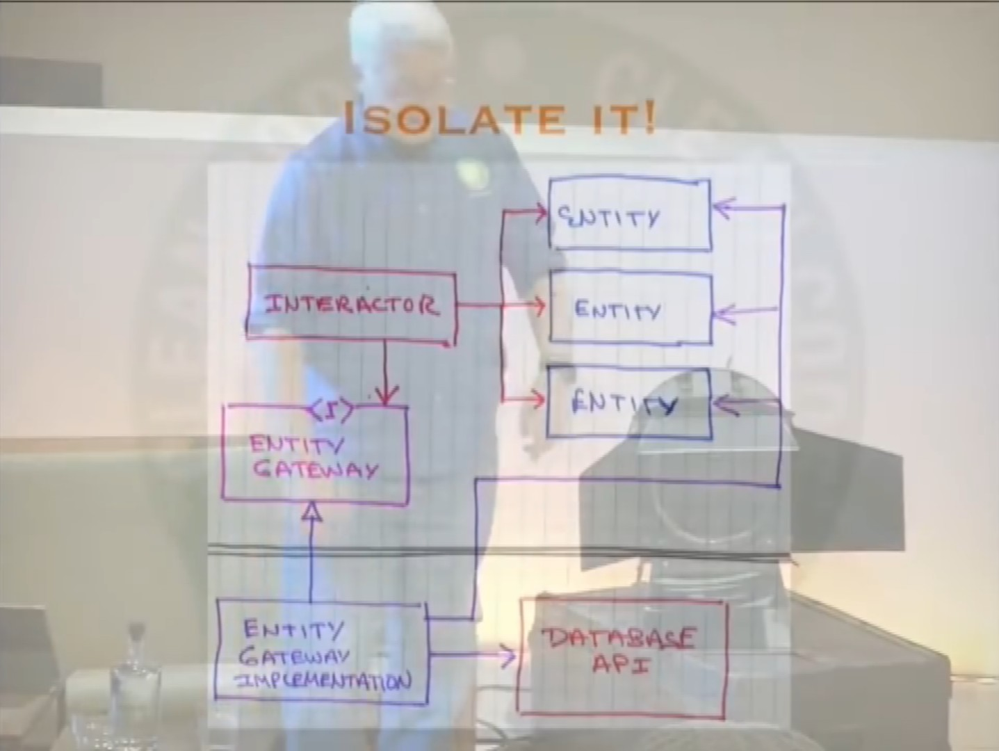

# Clean Code and other good patterns
## Clean Code - Lesson 5
[Timestamp](https://www.youtube.com/watch?v=sn0aFEMVTpA&t=5950&list=PLUxszVpqZTNShoypLQW9a4dEcffsoZT4k&index=6) about the database being a detail.

